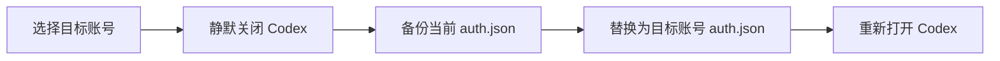

<div align="center">
  

  <h1>Codex Account Switcher</h1>

  <p><strong>一个本地优先、快速且可视化的 Codex 多账号管理工具。</strong></p>

  <p>
    <a href="./README.md">简体中文</a>
    ·
    <a href="./README_EN.md">English</a>
  </p>

  <p>
    
    
    
    
    
  </p>
</div>

> [!IMPORTANT]
> 本项目是社区工具，与 OpenAI 无隶属或官方关联。账号认证文件包含敏感凭据，请勿分享 `auth.json`、账号备份或完整的 `.codex` 目录。

## 为什么使用它

当你需要在个人、工作或团队 Codex 账号之间切换时，手动退出、登录和检查用量会打断工作流。Codex Account Switcher 将这些操作整合到一个桌面应用中：

- **快速切换账号**：静默关闭 Codex，备份当前认证文件，切换账号后重新打开 Codex。
- **自动识别账号**：从认证信息中识别邮箱和订阅类型，也支持手动覆盖订阅类型。
- **集中查看用量**：查看各账号的 5 小时和 7 天使用窗口，并按设置定期刷新。
- **本机 Token 分析**：扫描本地 Codex 会话记录，展示今日统计、14 天趋势和每日用量墙。
- **本地优先**：账号副本、元数据、设置和备份均保存在本机 Codex Home 中。

## 功能概览

| 功能 | 状态 | 说明 |
| --- | :---: | --- |
| 多账号保存与切换 | ✅ | 使用邮箱作为账号名，支持重命名、删除和优先标记 |
| 安全切换流程 | ✅ | 切换前关闭 Codex、备份 `auth.json`，完成后重新启动 |
| 新账号登录引导 | ✅ | 已保存账号激活时，先退出登录并等待新认证文件生成 |
| 邮箱与订阅识别 | ✅ | 从本地认证信息识别邮箱与 Free / Plus / Pro / Team 等订阅 |
| 官方用量查询 | ✅ | 查询账号的 Codex 使用窗口，支持启动、切换后和定时刷新 |
| Token 本地统计 | ✅ | 从本机会话记录统计输入、缓存输入、输出和推理 Token |
| 用量分析页面 | ✅ | 每日用量墙、今日 Token、累计 Token 和 14 天动态柱状图 |
| 自动备份与设置 | ✅ | 支持自定义 Codex Home、备份保留数量和明暗主题 |
| 智能切换与健康检查 | ✅ | 综合账号健康、优先级和剩余额度推荐切换目标 |
| 系统托盘与额度通知 | ✅ | 后台驻留、托盘快捷切换，并在额度达到阈值时通知 |
| 切换历史 | ✅ | 记录账号切换来源、目标、时间和执行结果 |

## 快速开始

### 环境要求

- Windows 10 / 11
- 已安装并登录过 Codex
- 从源码构建时需要：
  - [Node.js](https://nodejs.org/) 18+
  - [Rust](https://www.rust-lang.org/tools/install) 1.77.2+
  - [Tauri 2 prerequisites](https://v2.tauri.app/start/prerequisites/)

### 从源码运行

```powershell
git clone https://github.com/wwrrj/Codex-Switcher.git
cd Codex-Switcher/react-vite
npm install
npx tauri dev
```

### 构建安装包

```powershell
cd react-vite
npm install
npx tauri build
```

构建产物位于：

```text
react-vite/src-tauri/target/release/bundle/
├── msi/
└── nsis/
```

## 使用方式

1. 启动应用，程序会自动检测 `~/.codex/auth.json` 和当前登录账号。
2. 点击添加账号，将当前账号保存至账号池；如果当前账号已保存，程序会引导登录新账号。
3. 在账号池中选择目标账号并执行切换。程序会关闭 Codex、备份认证文件、完成替换，然后重新打开 Codex。
4. 进入「用量分析」页面查看每日用量、今日 Token 和最近 14 天趋势。
5. 在设置中调整用量刷新间隔、备份数量、Codex Home 路径和主题。

## 工作原理

Codex CLI 从 Codex Home 中读取当前认证文件。本工具将每个账号的认证文件副本保存在独立目录，切换时替换当前 `auth.json`。

```text
~/.codex/
├── auth.json                    # Codex 当前使用的认证文件
├── accounts/
│   └── user@example.com/
│       ├── auth.json            # 本工具保存的账号副本
│       └── meta.json            # 名称、备注、订阅等元数据
├── config/
│   ├── settings.json
│   └── priorities.json
└── backups/                     # 切换前自动备份
```

切换流程：



## 数据与隐私

- 账号认证文件和备份仅保存在本机，不会上传到本项目维护者的服务器。
- 用量查询会使用本地认证信息请求 Codex 官方用量接口。
- Token 统计来自本机 Codex 会话与归档记录。
- `auth.json` 会被复制保存且**未额外加密**。请保护你的系统账户和 Codex Home 目录。
- 删除应用前，请根据需要手动清理 `~/.codex/accounts` 和 `~/.codex/backups`。

## 技术栈

- **桌面端**：[Tauri 2](https://v2.tauri.app/) + Rust
- **前端**：[React 18](https://react.dev/) + TypeScript + Vite
- **样式**：[Tailwind CSS](https://tailwindcss.com/)
- **状态管理**：[Zustand](https://zustand.docs.pmnd.rs/)

## 项目结构

```text
Codex-Switcher/
├── react-vite/
│   ├── src/                     # React 前端
│   │   ├── components/
│   │   ├── lib/
│   │   └── store/
│   └── src-tauri/               # Rust / Tauri 后端
│       ├── src/
│       └── tauri.conf.json
└── README.md
```

## 开发与验证

```powershell
# 前端生产构建
cd react-vite
npm run build

# Rust 构建与测试
cd src-tauri
cargo build
cargo test

# 完整桌面安装包
cd ..
npx tauri build
```

## 路线图

- [ ] 发布可直接下载的版本与变更日志
- [ ] 补充自动化测试和 CI
- [ ] 完善跨平台进程管理与打包验证
- [ ] 增加数据导出与更丰富的统计维度
- [ ] 为敏感账号副本提供可选加密

## 参与贡献

欢迎提交 Issue 和 Pull Request。提交改动前请确保：

1. 不提交任何真实的 `auth.json`、Token、邮箱或本地 Codex 数据。
2. 前端构建、Rust 构建和测试全部通过。
3. 提交信息遵循 [Conventional Commits](https://www.conventionalcommits.org/)。

## 致谢

- [OpenAI Codex](https://github.com/openai/codex)
- [Tauri](https://tauri.app/)
- [React](https://react.dev/)

---

<div align="center">
  如果这个项目对你有帮助，可以为仓库点一个 Star。
</div>
