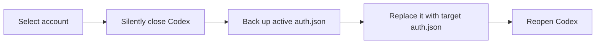

<div align="center">
  

  <h1>Codex Account Switcher</h1>

  <p><strong>A local-first, fast, and visual multi-account manager for Codex.</strong></p>

  <p>
    <a href="./README.md">English</a>
    ·
    <a href="./README_CN.md">简体中文</a>
  </p>

  <p>
    
    
    
    
    
  </p>
</div>

> [!IMPORTANT]
> This is a community project and is not affiliated with or endorsed by OpenAI. Authentication files contain sensitive credentials. Never share `auth.json`, account backups, or your complete `.codex` directory.

## Why Use It

Manually signing out, signing in, and checking usage interrupts your workflow when you use personal, work, or team Codex accounts. Codex Account Switcher brings those tasks into one desktop application:

- **Switch accounts quickly**: silently close Codex, back up the active credentials, switch accounts, and reopen Codex.
- **Identify accounts automatically**: detect email addresses and subscription plans, with optional manual plan overrides.
- **Monitor usage centrally**: view the 5-hour and 7-day usage windows for each account with configurable periodic refresh.
- **Analyze local tokens**: scan local Codex session records for today's totals, a 14-day trend, and a daily usage heatmap.
- **Stay local-first**: account copies, metadata, settings, and backups remain inside your local Codex Home.

## Features

| Feature | Status | Description |
| --- | :---: | --- |
| Multi-account management | ✅ | Uses email addresses as account names; supports rename, delete, and priority flags |
| Safe switching workflow | ✅ | Closes Codex, backs up `auth.json`, switches credentials, and reopens Codex |
| New-account login guide | ✅ | Signs out an already-saved active account and waits for new credentials |
| Email and plan detection | ✅ | Detects email and Free / Plus / Pro / Team plans from local authentication data |
| Official usage queries | ✅ | Queries Codex usage windows on startup, after switching, or periodically |
| Local token statistics | ✅ | Counts input, cached input, output, and reasoning tokens from local sessions |
| Usage analytics | ✅ | Daily heatmap, today's tokens, lifetime tokens, and a dynamic 14-day chart |
| Backups and settings | ✅ | Custom Codex Home, backup retention, refresh interval, and light/dark themes |
| Smart switching and health checks | ✅ | Recommends accounts using health, priority, and remaining usage |
| System tray and usage alerts | ✅ | Runs in the tray, provides quick switching, and notifies at usage thresholds |
| Switch history | ✅ | Records source, destination, time, and result for account switches |

## Quick Start

### Requirements

- Windows 10 / 11
- Codex installed and signed in at least once
- To build from source:
  - [Node.js](https://nodejs.org/) 18+
  - [Rust](https://www.rust-lang.org/tools/install) 1.77.2+
  - [Tauri 2 prerequisites](https://v2.tauri.app/start/prerequisites/)

### Run from Source

```powershell
git clone https://github.com/wwrrj/Codex-Switcher.git
cd Codex-Switcher/react-vite
npm install
npx tauri dev
```

### Build Installers

```powershell
cd react-vite
npm install
npx tauri build
```

Build artifacts are written to:

```text
react-vite/src-tauri/target/release/bundle/
├── msi/
└── nsis/
```

## Usage

1. Start the application. It automatically detects `~/.codex/auth.json` and the active account.
2. Add the current account to the account pool. If it is already saved, the application guides you through signing in to a new account.
3. Select a target account and switch. The application closes Codex, backs up the credentials, replaces them, and reopens Codex.
4. Open Usage Analytics to inspect daily usage, today's tokens, and the latest 14-day trend.
5. Configure refresh intervals, backup retention, Codex Home, and theme in Settings.

## How It Works

Codex reads the active authentication file from Codex Home. This application keeps each saved account in a separate directory and replaces the active `auth.json` during a switch.

```text
~/.codex/
├── auth.json                    # Active credentials read by Codex
├── accounts/
│   └── user@example.com/
│       ├── auth.json            # Account copy managed by this application
│       └── meta.json            # Name, note, subscription, and metadata
├── config/
│   ├── settings.json
│   └── priorities.json
└── backups/                     # Automatic pre-switch backups
```

Switching flow:



## Data and Privacy

- Authentication files and backups remain on your machine and are not uploaded to a server operated by this project.
- Usage queries use local authentication data to call the official Codex usage endpoint.
- Token statistics come from local Codex session and archived rollout records.
- Saved `auth.json` copies are **not additionally encrypted**. Protect your operating-system account and Codex Home directory.
- If needed, manually remove `~/.codex/accounts` and `~/.codex/backups` when uninstalling.

## Tech Stack

- **Desktop**: [Tauri 2](https://v2.tauri.app/) + Rust
- **Frontend**: [React 18](https://react.dev/) + TypeScript + Vite
- **Styling**: [Tailwind CSS](https://tailwindcss.com/)
- **State**: [Zustand](https://zustand.docs.pmnd.rs/)

## Project Structure

```text
Codex-Switcher/
├── react-vite/
│   ├── src/                     # React frontend
│   │   ├── components/
│   │   ├── lib/
│   │   └── store/
│   └── src-tauri/               # Rust / Tauri backend
│       ├── src/
│       └── tauri.conf.json
└── README.md
```

## Development and Verification

```powershell
# Frontend production build
cd react-vite
npm run build

# Rust build and tests
cd src-tauri
cargo build
cargo test

# Complete desktop installers
cd ..
npx tauri build
```

## Roadmap

- [ ] Publish downloadable releases and changelogs
- [ ] Add automated tests and CI
- [ ] Complete cross-platform process management and packaging verification
- [ ] Add data export and richer analytics
- [ ] Provide optional encryption for sensitive account copies

## Contributing

Issues and pull requests are welcome. Before submitting a change:

1. Never commit a real `auth.json`, token, email address, or local Codex data.
2. Ensure the frontend build, Rust build, and tests pass.
3. Follow [Conventional Commits](https://www.conventionalcommits.org/) for commit messages.

## Acknowledgements

- [OpenAI Codex](https://github.com/openai/codex)
- [Tauri](https://tauri.app/)
- [React](https://react.dev/)

---

<div align="center">
  If this project helps you, consider giving the repository a Star.
</div>
