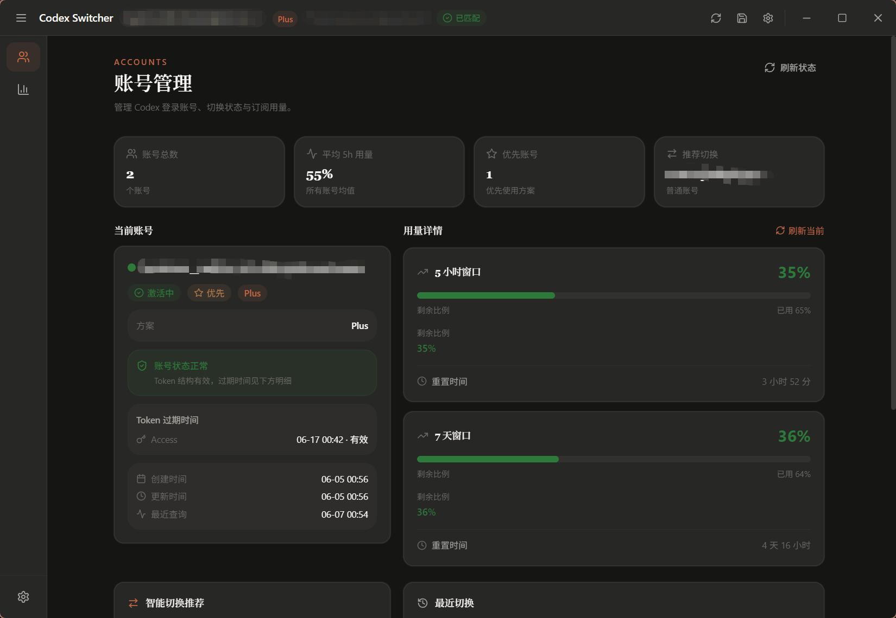
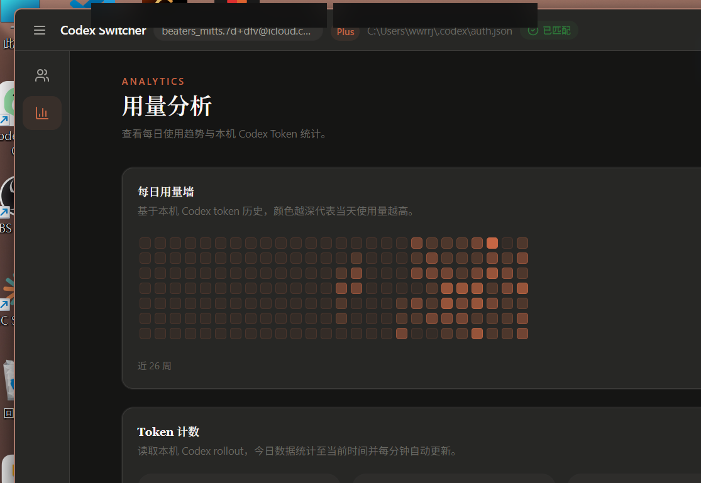
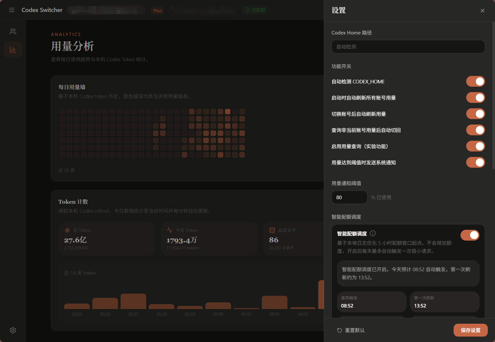
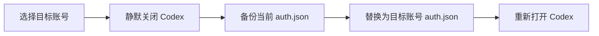

<div align="center">
  

  <h1>Codex Account Switcher</h1>

  <p><strong>一个本地优先、快速且可视化的 Codex 多账号管理工具，适用于 Windows。</strong></p>

  <p>
    <a href="./README.md">English</a>
    ·
    <a href="./README_CN.md">简体中文</a>
  </p>

  <p>
    
    
    
    
    
  </p>
</div>

> [!IMPORTANT]
> 本项目由社区维护，与 OpenAI 没有隶属或官方关联。账号认证文件包含敏感凭据，请不要分享 `auth.json`、账号备份或完整的 `.codex` 目录。

## 概览

Codex Account Switcher 让 Codex 使用流程保持本地、快速、可视化：

- 无需手动处理文件即可切换账号。
- 从本地认证字节中识别账号邮箱和订阅信息。
- 支持 5 小时和 7 天额度窗口查询，并按计划自动刷新。
- 读取本地 Codex token 记录，展示每日热力图、今日统计和 14 天趋势。
- 账号副本、设置和备份全部保存在本地 Codex Home。

## 截图

下面的截图来自最新构建，并已在发布前脱敏。

<table>
  <tr>
    <td width="33%">
      
    </td>
    <td width="33%">
      
    </td>
    <td width="33%">
      
    </td>
  </tr>
</table>

## 主要功能

| 功能 | 说明 |
| --- | --- |
| 账号身份与健康 | 识别邮箱、订阅类型、Access Token 过期时间和账号健康状态，并支持手动订阅覆盖 |
| 安全账号切换 | 静默关闭 Codex、备份 `auth.json`、替换凭据、重新打开 Codex，并记录切换历史 |
| 用量查询与缓存 | 查询官方用量窗口，启动时先展示缓存，支持启动、切换后和定时刷新，并可在查询后切回原账号 |
| 本地 Token 分析 | 扫描本地 Codex 记录，统计总量、今日、输入、缓存输入、输出和推理 Token，并展示热力图和 14 天趋势 |
| 智能配额调度 | 学习本地使用习惯，推荐或手动设定 5 小时额度触发时间，显示置信度，并在无收益时自动暂停 |
| 托盘与桌面体验 | 提供自定义标题栏、侧边栏状态记忆、自定义托盘菜单、快速切号、刷新用量和窗口控制 |
| 设置与本地数据管理 | 支持自定义 Codex Home、自动检测 `CODEX_HOME`、备份保留数量、用量通知、刷新策略和主题设置 |

## 快速开始

### 环境要求

- Windows 10 / 11
- 已安装并至少登录过一次 Codex
- 从源码构建时需要：
  - [Node.js](https://nodejs.org/) 18+
  - [Rust](https://www.rust-lang.org/tools/install) 1.77.2+
  - [Tauri 2 prerequisites](https://v2.tauri.app/start/prerequisites/)

### 从源码运行

```powershell
git clone https://github.com/wwrrj/Codex-Switcher.git
cd Codex-Switcher/react-vite
npm install
npx tauri dev
```

### 构建安装包

```powershell
cd react-vite
npm install
npx tauri build
```

构建产物位于：

```text
react-vite/src-tauri/target/release/bundle/
├── msi/
└── nsis/
```

## 使用方式

1. 启动应用，程序会自动检测 `~/.codex/auth.json` 和当前登录账号。
2. 点击添加账号，将当前账号保存至账号池；如果当前账号已经保存，程序会引导你登录新账号。
3. 在账号池中选择目标账号并执行切换。程序会关闭 Codex、备份认证文件、完成替换，然后重新打开 Codex。
4. 进入「用量分析」页面查看每日热力图、今日 Token 和最近 14 天趋势。
5. 在设置中调整刷新间隔、备份数量、Codex Home 路径和主题。

## 工作原理

Codex CLI 会从 Codex Home 中读取当前认证文件。本工具将每个账号的认证文件副本保存在独立目录，切换时替换当前 `auth.json`。

```text
~/.codex/
├── auth.json                    # Codex 当前使用的认证文件
├── accounts/
│   └── user@example.com/
│       ├── auth.json            # 本工具保存的账号副本
│       └── meta.json            # 名称、备注、订阅等元数据
├── config/
│   ├── settings.json
│   └── priorities.json
└── backups/                     # 切换前自动备份
```

切换流程：



## 数据与隐私

- 账号认证文件和备份只保存在本机，不会上传到本项目维护者的服务器。
- 用量查询会使用本地认证信息请求 Codex 官方用量接口。
- Token 统计来自本机 Codex 会话记录。
- `auth.json` 会被复制保存，且**不会额外加密**。请保护你的系统账户和 Codex Home 目录。
- 如果需要彻底清理，请在卸载前手动删除 `~/.codex/accounts` 和 `~/.codex/backups`。

## 技术栈

- **桌面端**：[Tauri 2](https://v2.tauri.app/) + Rust
- **前端**：[React 18](https://react.dev/) + TypeScript + Vite
- **样式**：[Tailwind CSS](https://tailwindcss.com/)
- **状态管理**：[Zustand](https://zustand.docs.pmnd.rs/)

## 项目结构

```text
Codex-Switcher/
├── react-vite/
│   ├── src/                     # React 前端
│   │   ├── components/
│   │   ├── lib/
│   │   └── store/
│   └── src-tauri/               # Rust / Tauri 后端
│       ├── src/
│       └── tauri.conf.json
├── docs/
│   └── images/
└── README.md
```

## 开发与验证

```powershell
# 前端生产构建
cd react-vite
npm run build

# Rust 构建与测试
cd src-tauri
cargo build
cargo test

# 完整桌面安装包
cd ..
npx tauri build
```

## 路线图

- [ ] 发布可直接下载的版本与变更日志
- [ ] 补充自动化测试和 CI
- [ ] 完善跨平台进程管理与打包验证
- [ ] 增加数据导出与更丰富的统计维度
- [ ] 为敏感账号副本提供可选加密

## 参与贡献

欢迎提交 Issue 和 Pull Request。提交改动前请确保：

1. 不提交任何真实的 `auth.json`、Token、邮箱或本地 Codex 数据。
2. 前端构建、Rust 构建和测试全部通过。
3. 提交信息遵循 [Conventional Commits](https://www.conventionalcommits.org/)。

## 致谢

- [OpenAI Codex](https://github.com/openai/codex)
- [Tauri](https://tauri.app/)
- [React](https://react.dev/)

---

<div align="center">
  如果这个项目对你有帮助，可以为仓库点一个 Star。
</div>
